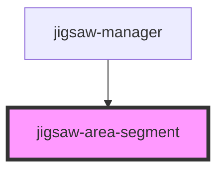

# jigsaw-area-segment

<!-- Auto Generated Below -->

## Properties

| Property    | Attribute    | Description | Type     | Default     |
| ----------- | ------------ | ----------- | -------- | ----------- |
| `tileImage` | `tile-image` |             | `string` | `undefined` |

## Dependencies

### Used by

 - [jigsaw-manager](../jigsaw-manager)

### Graph

----------------------------------------------

*Built with [StencilJS](https://stenciljs.com/)*
